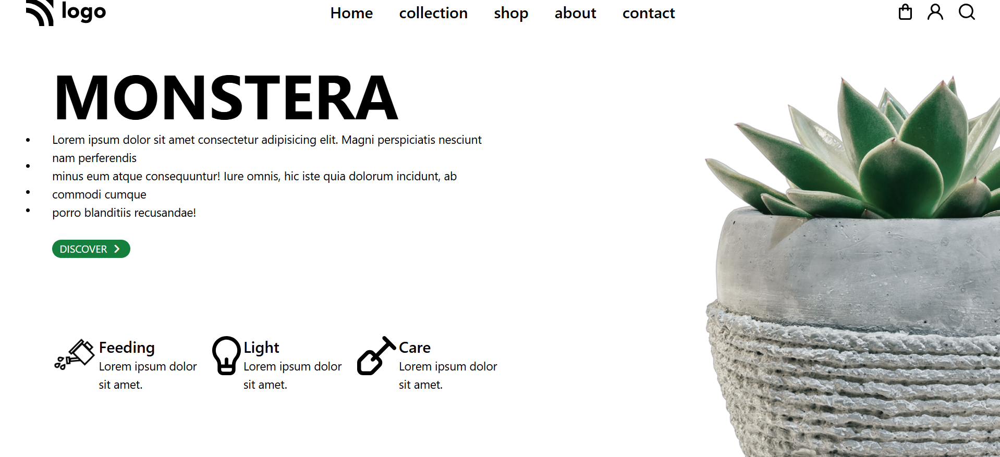

# 🌿 Monstera Landing Page 


# 📌 Project Overview

The **Monstera Landing Page** is a modern UI design focused on presenting a plant-themed product or brand. It combines typography, spacing, and imagery to create a clean and engaging user experience.

This project is ideal for:

* Practicing responsive web design
* Understanding layout structuring with Tailwind CSS
* Improving UI/UX design skills

---

# 🎯 Objectives

* Build a responsive layout for **mobile, tablet, and desktop**
* Use **Tailwind CSS utility classes effectively**
* Implement **clean typography and spacing**
* Practice **positioning (absolute, relative, flexbox)**

---

# ✨ Features Breakdown

## 🔹 1. Responsive Navigation Bar

* Logo aligned to the left
* Navigation links displayed on **large screens**
* Hamburger menu icon for **mobile devices**
* Action icons:

  * Cart 🛒
  * User 👤
  * Search 🔍

### 💡 Concepts Used:

* `flex`, `justify-between`, `items-center`
* `hidden lg:flex`
* Responsive visibility control

---

## 🔹 2. Hero Section

* Large bold heading: **MONSTERA**
* Supporting paragraph text
* Call-to-action button: **DISCOVER →**
* Center image for mobile view
* Decorative right-side image for desktop

### 💡 Concepts Used:

* Typography scaling (`text-[60px]`, `md:text-8xl`)
* Absolute positioning for images
* Responsive alignment (`text-center`, `lg:text-left`)

---

## 🔹 3. Decorative Image Placement

### 📱 Mobile:

* Center plant image displayed

### 💻 Desktop:

* Right-side decorative plant image

### 💡 Concepts Used:

* `absolute`, `relative`
* `hidden lg:flex`
* Layering visuals

---

## 🔹 4. Feature Section (Plant Care Info)

Three feature blocks:

* 🌱 Feeding
* ☀️ Light
* 🌿 Care

Each includes:

* Icon/image
* Title
* Description

### 💡 Concepts Used:

* Horizontal layout with `flex`
* Spacing using `gap`
* Negative margin (`-ml-5`) for alignment

preview


[live](https://anandhues2004-kerala.github.io/Monstera-Landing-Page-/)





---

# 🛠️ Technologies Used

## 🔸 HTML5

* Semantic structure
* Clean and readable markup

## 🔸 Tailwind CSS

* Utility-first styling approach
* Responsive breakpoints:

  * `sm` → small devices
  * `md` → tablets
  * `lg` → desktops
  * `xl` → large screens

## 🔸 Google Fonts

Used fonts:

* **Poppins** → Body text
* **Montserrat** → Headings
* Additional fonts for styling flexibility

## 🔸 Font Awesome

* Icons for UI elements (menu, arrow)

---

# 📂 Folder Structure

```id="c2g8pj"
project-folder/
│
├── index.html              # Main HTML file
│
├── photos/                # UI assets
│   ├── Logo.svg
│   ├── cart.svg
│   ├── user.svg
│   ├── search.svg
│   ├── springler.png
│   ├── light.svg
│   ├── plough.svg
│
├── 6_folwer.png           # Center plant image (mobile)
├── 6_folwer_cut.png       # Decorative right-side image
```

---

# 🚀 How to Run the Project

1. Download or clone the repository
2. Open the project folder
3. Double-click `index.html`

✅ No build tools or installation required
✅ Works directly in browser

---

# 📱 Responsive Design Strategy

| Device Type | Layout Behavior                    |
| ----------- | ---------------------------------- |
| Mobile      | Centered content, hidden nav links |
| Tablet      | Improved spacing and scaling       |
| Desktop     | Split layout with side image       |

### Key Tailwind Classes:

* `hidden lg:flex`
* `text-center lg:text-left`
* `w-[300px] md:w-[400px]`

---

# 🎨 Design Highlights

* Clean and minimal UI
* Nature-inspired theme 🌿
* Balanced whitespace
* Strong typography hierarchy
* Smooth visual flow from top to bottom

# 👨‍💻 Author

**Anandhu Es**

* 🎓 BCA Graduate (2025)
* 💻 Learning Python Full Stack Development
